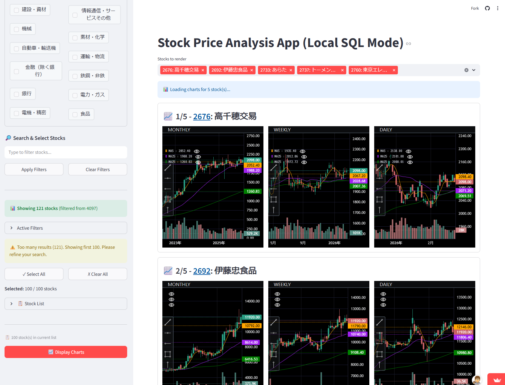
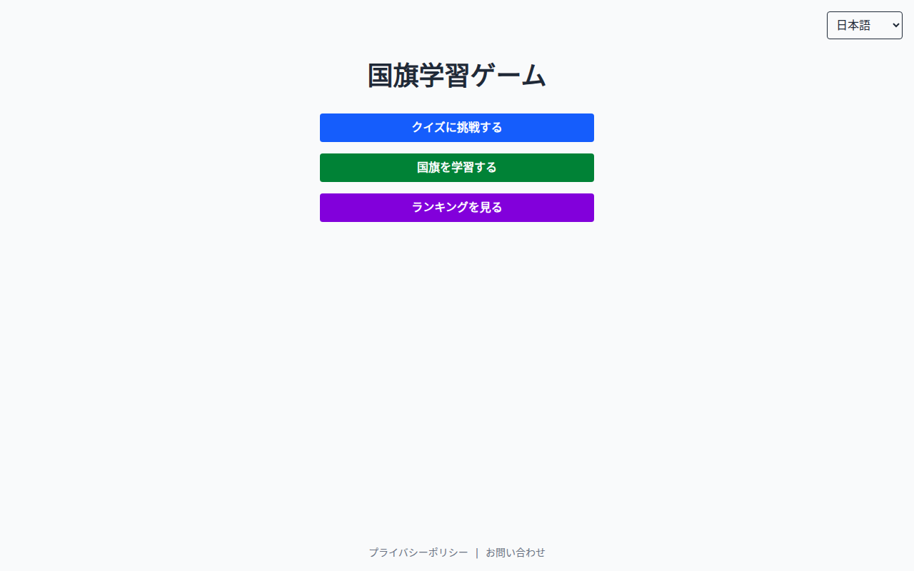
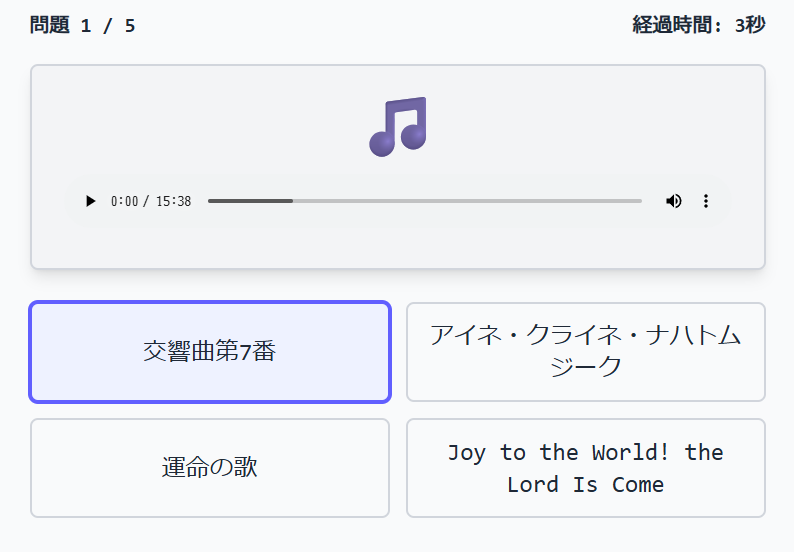
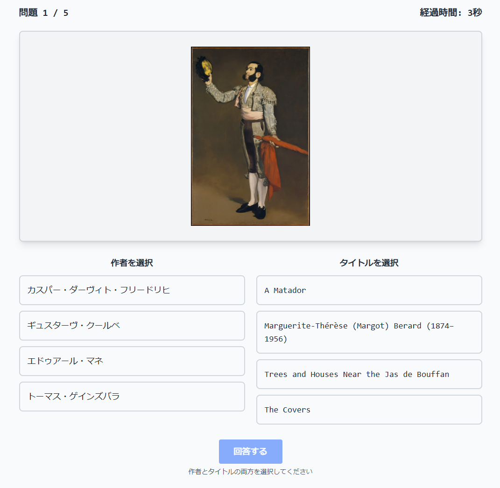
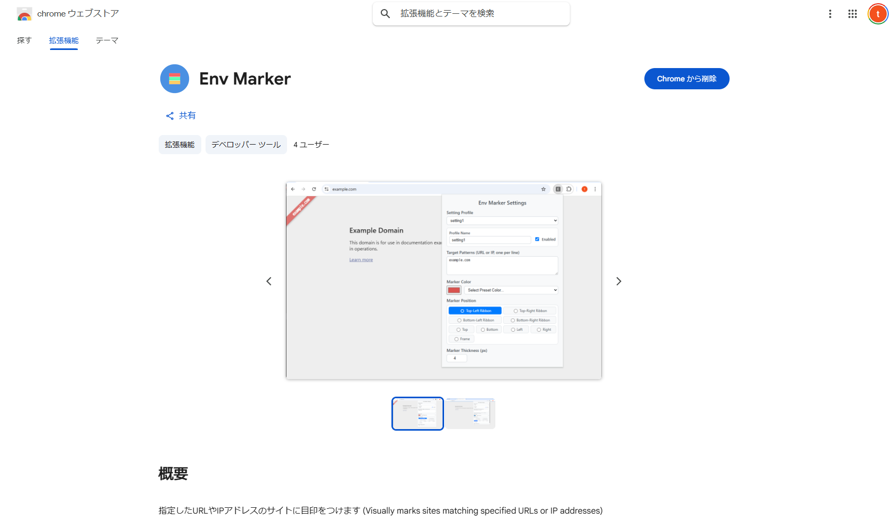
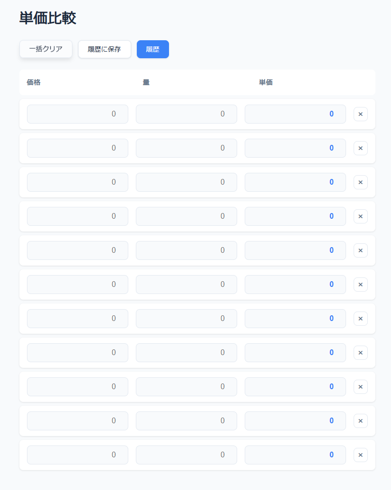

# 👋 Hi, I’m @oharato

- 🚀 **Full-stack Engineer** with 12 years of experience, specializing in **System Modernization & Data Engineering**.
- 🛠️ **Expertise:** Transforming legacy architectures into high-performance, modern environments.
- 📈 **Key Achievement:** Built a group-wide data foundation on **Snowflake**, integrating 2M+ customer records with high integrity.
- 🏗️ **Core Skill:** Robust backend development with **Java (Spring Boot)** and **PHP**, combined with modern frontend practices in **TypeScript**.

### 🛠 Tech Stack
- **Languages:** Java, PHP, TypeScript, JavaScript, Ruby, Python, SQL
- **Frameworks:** Spring Boot, Vue.js, Ruby on Rails
- **Data & Infra:** Snowflake, dbt, Oracle DB, AWS, Docker
- **Tools:** GitHub Actions, Gradle, Vite, Flyway

### 🔥 Highlighted Results
- **Modernization:** Led the migration from Ant to **Gradle** and Vue 2 to **Vue 3/Vite**, drastically improving developer experience (DX).
- **Automation:** Eliminated manual DB operations by implementing automated migrations via **Flyway**.
- **Security:** Unified disparate authentication systems into a central **SSO (SAML)** platform.

### 💞️ Interests
- **Developer Experience (DX):** Building tools that make engineering teams more productive and "Happy."
- **Financial Tech:** System architecture for credit scoring and stablecoins (JPYC).
- **Personal:** High-fidelity audio and the therapeutic benefits of Onsen.

## 💼 Portfolio

### 金融系

#### 📦 [stock-data](https://github.com/oharato/stock-data)
- **概要**: 日本株の株価データをスクレイピングし、DuckDBデータベースとしてビルド・配信するプロジェクトです。GitHub Actions を利用した自動ビルド、GitHub Cache を用いた高速な差分更新、Releases への自動アセットアップロード（`stock.duckdb`）に対応しており、MCP (Model Context Protocol) 経由でAIアシスタントから直接データ分析を行うことも可能です。
- **アプリURL**: (なし)
- **リポジトリURL**: https://github.com/oharato/stock-data

#### 📈 [sectorflow-jp](https://github.com/oharato/sectorflow-jp)
- **概要**: 東証33業種の株価指数データをJPXから取得・更新し、セクターごとのトレンド動向を追跡・管理するためのツールです。
- **アプリURL**: (なし)
- **リポジトリURL**: https://github.com/oharato/sectorflow-jp

#### 📑 [tdnet-ts](https://github.com/oharato/tdnet-ts)
- **概要**: TDnet（適時開示情報閲覧サービス）から開示情報を取得し、Markdownへの変換やSQLiteデータベースでの管理、検索ができるTypeScriptライブラリおよびCLIツールです。GitHub Actionsを利用した定期データ同期とGitHub Pagesへの自動デプロイ機能を備えています。
- **アプリURL**: (なし)
- **リポジトリURL**: https://github.com/oharato/tdnet-ts

#### 📊 [databricks](https://github.com/oharato/databricks)
- **概要**: Databricks 上の株価データ (`main.default.stock_prices`) を可視化する Streamlit アプリケーションです。
- **アプリURL**: https://oharato-stock-analyze-on-databricks.streamlit.app/
   
- **リポジトリURL**: https://github.com/oharato/databricks

#### 📈 [edinet-ts](https://github.com/oharato/edinet-ts)
- **概要**: EDINETのXBRLファイルをダウンロードして解析するTypeScriptライブラリです。
- **アプリURL**: https://www.npmjs.com/package/edinet-ts
- **リポジトリURL**: https://github.com/oharato/edinet-ts

#### 💹 [tachibana-ts](https://github.com/oharato/tachibana-ts)
- **概要**: 非公式 立花証券 API SDK & CLI ツール
- **アプリURL**: (なし)
- **リポジトリURL**: https://github.com/oharato/tachibana-ts

#### 🚀 [stock-analyze](https://github.com/oharato/stock-analyze)
- **概要**: 株価分析基盤です。開発中。
- **アプリURL**: (なし)
- **リポジトリURL**: https://github.com/oharato/stock-analyze

### 学習・教育系

#### 🌍 [world-flags-learning](https://github.com/oharato/world-flags-learning)
- **概要**: 国旗学習アプリ
- **アプリURL**: https://world-flags-learning.ohchans.com
   
- **リポジトリURL**: https://github.com/oharato/world-flags-learning

#### 🎵 [classic-music-learning](https://github.com/oharato/classic-music-learning)
- **概要**: クラシック音楽をクイズ形式で学びましょう！
- **アプリURL**: https://classic-music-learning.pages.dev/
   
- **リポジトリURL**: https://github.com/oharato/classic-music-learning

#### 🎨 [world-paintings-learning](https://github.com/oharato/world-paintings-learning)
- **概要**: 世界の名画をクイズ形式で学びましょう！開発中。
- **アプリURL**: https://world-paintings-learning.pages.dev/
   
- **リポジトリURL**: https://github.com/oharato/world-paintings-learning

#### 💯 [hundred-cells](https://github.com/oharato/hundred-cells)
- **概要**: 10x10のマスに数字を入力していき、正解数と回答時間を記録する計算ゲームアプリです。
- **アプリURL**: (なし)
- **リポジトリURL**: https://github.com/oharato/hundred-cells

### ツール系

#### 🔖 [env-marker](https://github.com/oharato/env-marker)
- **概要**: 指定したURLやIPアドレスのサイトを開いたときに、視覚的に識別しやすくするためのChrome拡張機能です。
- **アプリURL**: https://chromewebstore.google.com/detail/env-marker/lljeadhgeagbdihjhpdoajpjbpiobmej
   
- **リポジトリURL**: https://github.com/oharato/env-marker

#### 🚀 [marp-presentation](https://github.com/oharato/marp-presentation)
- **概要**: Azusa3 css, LINESeedJP font を利用した Marp 用のプレゼンテーションテンプレートです。
- **アプリURL**: (なし)
- **リポジトリURL**: https://github.com/oharato/marp-presentation

#### 📦 [item-manage](https://github.com/oharato/item-manage)
- **概要**: 家庭内の物品管理アプリケーション。書籍、CD、ゲーム、DVDなどをバーコードスキャンで簡単に登録し、所有状況（所有中/欲しいもの）を管理できます。
- **アプリURL**: (なし)
- **リポジトリURL**: https://github.com/oharato/item-manage

#### 🚀 [diagrams-ts](https://github.com/oharato/diagrams-ts)
- **概要**: PythonライブラリのDiagramをTypeScriptで実装したものです。
- **アプリURL**: (なし)
- **リポジトリURL**: https://github.com/oharato/diagrams-ts

#### 🚀 [unit-price-compare](https://github.com/oharato/unit-price-compare)
- **概要**: 単位あたりの価格を比較するアプリ
- **アプリURL**: https://oharato.github.io/unit-price-compare/
   
- **リポジトリURL**: https://github.com/oharato/unit-price-compare

